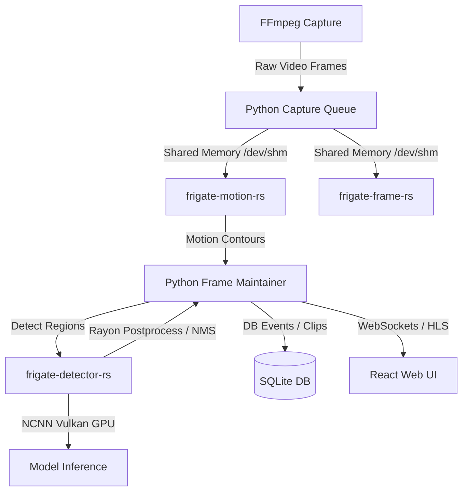

Frigate NVR is undergoing a progressive architectural migration from **Python** to **Rust** to optimize resource usage, reduce latency, and bypass Python's Global Interpreter Lock (GIL) under high frame rate and multi-camera workloads.

---

## Current Architecture

The codebase is split into Python and Rust modules. Python is used for high-level logic, routing, configuration, and database management, while Rust manages CPU-bound and high-throughput video pipelines.

---

## 🦀 Components in Rust

These performance-critical components have been successfully migrated to Rust:

1. **`frigate-detector-rs` & `frigate-yolo-rs`**:
   * Handles detector post-processing (DFL decoding, Non-Maximum Suppression (NMS), coordinate scaling, and class filters) in parallel via `rayon`.
   * Isolates unstable GPU compute runtimes (such as `ncnn` Vulkan) inside a lightweight subprocess worker, avoiding Python multiprocessing crashes.
2. **`frigate-motion-rs`**:
   * Analyzes high-framerate video frames to detect motion areas (frame subtraction, contour finding, thresholding).
   * Rewritten to drastically reduce CPU usage compared to Python's OpenCV loop.
3. **`frigate-frame-rs`**:
   * Performs raw frame manipulation, pixel format conversions (e.g., YUV to RGB), scaling, and crop operations directly in shared memory (`/dev/shm`).

---

## 🐍 Components Remaining in Python

The following high-level coordination and management services remain in Python:

1. **Web Server & Routing**:
   * FastAPI-based API server handling user authentication, camera profiles, static asset delivery, and WebSocket connection classification (`frigate/api/`).
2. **Configuration & Validation**:
   * Pydantic-based configuration loaders, validators, and dynamic defaults generator (`frigate/config/`).
3. **ORM & Database Management**:
   * SQLite operations (events, review segments, recordings metadata) managed via Peewee ORM and migrations (`frigate/models.py`, `migrations/`).
4. **Recording & Retention Manager**:
   * Segment collection, clip compilation, and automated disk cleanup based on retention configs (`frigate/recordings/`, `frigate/events/`).
5. **Telemetry & Stats**:
   * System resource utilization monitoring (CPU, GPU, RAM, SHM, storage) and stats reporting endpoints (`frigate/stats.py`).
6. **Subprocess Supervisors**:
   * Spawning, health monitoring, and lifecycle management of auxiliary runtimes (`go2rtc`, detector workers, FFmpeg).
7. **Semantic Search & Face Enrichments**:
   * Feature embedding database retrieval, clustering, and object enrichments (`frigate/data_processing/`).

---

## 🚀 Migration Candidates (Future Rust Candidates)

To further reduce resource footprints, the following components are targets for future Rust migration:

### 1. Frame Capture and Shared Memory Writer (`frigate/video/capture.py`)
* **Current state**: Python reads raw video bytes from FFmpeg pipes, parses frame boundaries, and copies bytes into shared memory (`/dev/shm`).
* **Rust target**: A lightweight Rust writer reading directly from FFmpeg stdout and executing zero-copy memory transfers, eliminating Python-level pipe I/O overhead.

### 2. Object Trackers (`frigate/object_processing.py`)
* **Current state**: Bounding box overlap calculations, Kalman filters, and identity association (SORT tracker) are processed sequentially in Python.
* **Rust target**: A concurrent Rust tracker library, allowing rapid geometric intersection-over-union (IoU) computations and parallel track updates.

### 3. Event Loop & Classifier (`frigate/events/`)
* **Current state**: Determines event states (start, active, end) by assessing confidence scores, area thresholds, and zone coordinates in Python.
* **Rust target**: Move classification and state triggers to Rust to prevent GIL lag during high-frequency camera events.

### 4. Telemetry Daemon
* **Current state**: Queries `psutil`, `/sys/class/drm`, and NVML via Python helpers.
* **Rust target**: A highly efficient system statistics collector running as a single native thread.
